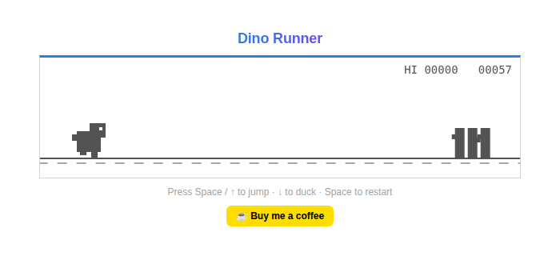

# 🦖 Dino Runner

A tiny, dependency-free recreation of the offline Chrome dinosaur game, built with a single HTML file and the Canvas API. Jump over cacti, duck under birds, and try to beat your high score — no install, no build step, just open it in a browser.



## Features

- Classic endless-runner gameplay: jump, duck, and dodge an increasing stream of cacti and birds
- Speed ramps up the longer you survive
- Day/night cycle that flips the palette as your score climbs
- High score saved locally in your browser (`localStorage`)
- Simple procedural sound effects via the Web Audio API — no audio files
- Touch/click support alongside keyboard controls

## How to play

| Action  | Key(s)              |
| ------- | ------------------- |
| Jump    | `Space` or `↑`       |
| Duck    | `↓`                  |
| Restart | `Space` after a crash |

You can also tap/click the game canvas to jump.

## Running it locally

Everything lives in `index.html` — there's nothing to install. Just open the file directly in a browser:

```bash
open index.html   # macOS
# or
xdg-open index.html   # Linux
```

If your browser blocks local file audio/scripts, serve it instead:

```bash
python3 -m http.server 8000
# then visit http://localhost:8000
```

## Support

If you enjoyed this little game, consider buying me a coffee ☕

[](https://www.buymeacoffee.com/msabramo)
